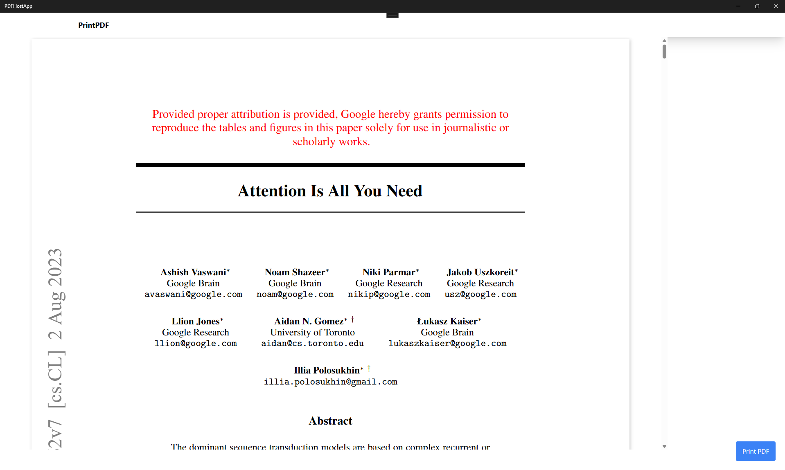

# PDF Viewer with UWP and React

This project combines a UWP application and a React web application to create a seamless PDF viewing and printing experience. The UWP app hosts a WebView2 control that loads a React application, which renders PDFs using the React PDF viewer.



## Architecture

The project consists of two main components:

1. **UWP Application**: Hosts a WebView2 control that loads the React app. It also handles native operations like accessing local files and system printing.
2. **React Application**: A web application built with React and Vite that renders PDFs using React PDF Viewer.

The communication between these components is handled via:
- HTTP requests for PDF uploads from UWP to the Node.js server
- WebView2 message passing between React and UWP

## Prerequisites

- [Node.js](https://nodejs.org/) (v14 or later)
- [Visual Studio](https://visualstudio.microsoft.com/) with UWP development workload
- [.NET SDK](https://dotnet.microsoft.com/download) (compatible with your UWP project)

## Getting Started

### React Application Setup

1. **Clone the repository**
   ```bash
   git clone https://your-repo-url/React_Socket.git
   cd React_Socket
   ```

2. **Install dependencies**
   ```bash
   npm install
   ```

3. **Start the development server**
   ```bash
   npm run dev
   ```
   This will start both the Vite development server (http://localhost:5173) and the Express server (http://localhost:3001).

### UWP Application Setup

1. **Open the UWP solution in Visual Studio**
   
   Navigate to your UWP project directory and open the `.sln` file.

2. **Install WebView2 NuGet package**
   
   In Visual Studio, right-click on the UWP project and select "Manage NuGet Packages". Search for and install "Microsoft.Web.WebView2".

3. **Add a reference to the PDF assets**
   
   Place your PDF file in the Assets folder of the UWP project and set its build action to "Content".

4. **Build and run the UWP application**
   
   Press F5 or click the "Start Debugging" button in Visual Studio.

## How It Works

1. The UWP application starts and loads a PDF file from its Assets folder.
2. It sends the PDF to the Node.js server running at http://localhost:3001 via HTTP POST.
3. The server stores the PDF in the `uploads` folder and exposes an API to fetch the latest PDF.
4. The React application, loaded in the WebView2, fetches the latest PDF from the server.
5. The React PDF Viewer component displays the PDF.
6. When the user clicks the "Print" button, the React app sends a message to the UWP app via WebView2.
7. The UWP app can handle the print operation or perform other actions.

## Development

### React Application Structure

- `src/` - Contains the React application source code
  - `components/` - React components including the PDF Viewer
  - `App.jsx` - Main React component
  - `main.jsx` - Entry point
- `server.js` - Express server for handling PDF uploads and serving them

### UWP Application Structure

The UWP application includes:

```csharp
public sealed partial class MainPage : Page
{
    public MainPage()
    {
        this.InitializeComponent();
        Send();
        LoadReactApp("http://localhost:5173");
    }

    private async void Send()
    {
        await GetAndSendPdfFromAssets();
    }

    private async void LoadReactApp(string uriString)
    {
        try
        {
            Uri reactAppUri = new Uri(uriString);
            await ReactWebView2.EnsureCoreWebView2Async();
            ReactWebView2.Source = reactAppUri;
            ReactWebView2.CoreWebView2.WebMessageReceived += CoreWebView2_WebMessageReceived;
        }
        catch (UriFormatException ex)
        {
            var dialog = new Windows.UI.Popups.MessageDialog("Invalid URI format: " + ex.Message);
            await dialog.ShowAsync();
        }
    }

    private void CoreWebView2_WebMessageReceived(object sender, CoreWebView2WebMessageReceivedEventArgs e)
    {
        string message = e.TryGetWebMessageAsString();
        if (message == "printCompleted")
        {
            _ = this.Dispatcher.RunAsync(Windows.UI.Core.CoreDispatcherPriority.Normal, () =>
            {
                ReactWebView2.Visibility = Windows.UI.Xaml.Visibility.Collapsed;
                Application.Current.Exit();
            });
            Debug.WriteLine("Print completed, React app has closed.");
        }
        else
        {
            Debug.WriteLine($"Received message: {message}");
        }
    }

    // Additional methods for file handling and server communication
}
```

## Building for Production

### React Application

```bash
npm run build
```

This creates a production build in the `dist` directory.

### UWP Application

For a production UWP app:

1. Build the React app and copy the contents of the `dist` folder to the UWP project's `WebContent` folder.
2. Update the UWP app to load the local HTML file instead of the development server.
3. Package the UWP application for distribution through the Microsoft Store or sideloading.

## Troubleshooting

- **Server not responding**: Ensure both the Express server and Vite development server are running.
- **PDF not displaying**: Check if the PDF was successfully uploaded to the server's `uploads` folder.
- **WebView2 errors**: Make sure the WebView2 runtime is installed on your development machine.
- **CORS issues**: The server has CORS enabled, but check if additional headers are needed.

## License

[MIT](LICENSE)